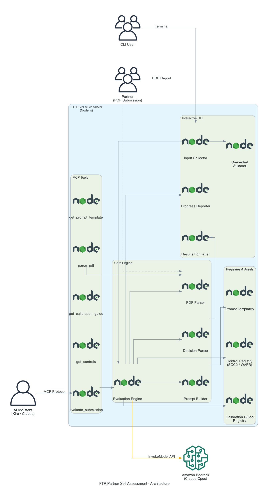

# FTR Partner Self-Assessment MCP Server (`@asp-sail/ftr-eval-mcp`)

An MCP server and interactive CLI that automates the AWS Foundational Technical Review (FTR) partner self-assessment process. It evaluates partner-submitted compliance documents (SOC 2 Type II reports and WAFR reports) against defined controls and returns structured PASS/FAIL decisions with reasoning.

## Architecture

The system connects partner-submitted PDF reports to Amazon Bedrock for LLM-powered evaluation. A Model Context Protocol (MCP) server exposes evaluation tools to AI assistants, while a standalone CLI provides a guided terminal workflow. Both paths share a common evaluation engine backed by Bedrock, SOC 2 and WAFR control registries, and calibration guides that shape scoring decisions.



## Overview

Partners seeking AWS validation must submit evidence for two distinct review tracks:

| Track | Document Required | Controls Evaluated |
|---|---|---|
| **SOC 2** | SOC 2 Type II Report | SOC-001 through SOC-005 |
| **WAFR** | AWS Well-Architected Framework Review Report | WAFR-FTR-001 through WAFR-FTR-005 |

This package provides three ways to evaluate submissions:

1. **MCP Server** — Exposes evaluation tools to AI assistants (Kiro, Claude, etc.) via the Model Context Protocol
2. **Interactive CLI** — A terminal-based evaluation workflow with guided prompts, progress spinners, and color-coded results
3. **Kiro Power** — A native Kiro IDE integration that loads calibration criteria directly into chat, no server or CLI required

## Installation

Choose the option that fits your environment.

### Option 1 — npm (requires Node.js >= 18)

```bash
npm install -g @asp-sail/ftr-eval-mcp
```

Once installed, the `ftr-eval-mcp` command is available globally:

```bash
ftr-eval-mcp evaluate
ftr-eval-mcp serve
```

### Option 2 — Standalone Binary (no Node.js required)

Download the binary for your platform from the [GitHub Releases](../../releases) page:

| Platform | File |
|---|---|
| macOS (Apple Silicon) | `ftr-eval-mcp-macos-arm64` |
| macOS (Intel) | `ftr-eval-mcp-macos-x64` |
| Linux x64 | `ftr-eval-mcp-linux-x64` |
| Linux ARM64 | `ftr-eval-mcp-linux-arm64` |
| Windows x64 | `ftr-eval-mcp-win-x64.exe` |

**macOS / Linux** — make the binary executable and run it:

```bash
chmod +x ftr-eval-mcp-macos-arm64
./ftr-eval-mcp-macos-arm64 evaluate
```

**Windows** — run it directly:

```cmd
ftr-eval-mcp-win-x64.exe evaluate
```

## Prerequisites

- AWS credentials configured (for Bedrock access)
- Node.js >= 18.0.0 (npm install path only — not required for standalone binaries)

## Configuration

The server uses sensible defaults out of the box. Override via environment variables or CLI flags:

| Environment Variable | CLI Flag | Default | Description |
|---|---|---|---|
| `FTR_AWS_REGION` | `--region` | `us-east-1` | AWS region for Bedrock API calls |
| `FTR_BEDROCK_MODEL` | `--model` | `global.anthropic.claude-opus-4-6-v1` | Bedrock model ID |
| `FTR_TRANSPORT` | `--transport` | `stdio` | MCP transport: `stdio` or `http` |
| `FTR_PORT` | `--port` | `3000` | Port for HTTP transport |
| `FTR_LOG_LEVEL` | N/A | `info` | Log level: `debug`, `info`, `warn`, `error` |

Resolution order (highest priority first): CLI flags → Environment variables → Defaults

Example with a custom region:

```bash
FTR_AWS_REGION=us-west-2 ftr-eval-mcp
```

Or in your MCP config:

```json
{
  "mcpServers": {
    "ftr-eval-mcp": {
      "command": "node",
      "args": ["dist/server.js", "serve"],
      "env": {
        "FTR_AWS_REGION": "eu-west-1"
      }
    }
  }
}
```

### MCP Config Levels

You can register this MCP server at different levels depending on your needs:

| Level | Config Path | Scope |
|---|---|---|
| **Workspace** | `<project>/.[IDE]/settings/mcp.json` | Only available when this specific project is open |
| **User (global)** | `~/.[IDE]/settings/mcp.json` | Available across all workspaces for the current user |

**Precedence:** Workspace config overrides user config. If the same server is defined at both levels, the workspace-level definition wins when that project is open. Outside that workspace, the user-level config applies.

**When to use each level:**

- **Workspace** — Best when developing or testing the server locally. The config lives with the project and won't affect other workspaces.
- **User** — Best when the server is stable and you want it available everywhere without per-project setup.

Example workspace config (`.kiro/settings/mcp.json`):

```json
{
  "mcpServers": {
    "ftr-eval-mcp": {
      "command": "node",
      "args": ["/path/to/dist/server.js", "serve"],
      "disabled": false,
      "autoApprove": ["get_prompt_template", "parse_pdf", "evaluate_submission"]
    }
  }
}
```

The `autoApprove` array lists tool names that the AI assistant can invoke without prompting for confirmation. Tools not in this list require manual approval before each execution.

## Usage

### MCP Server Mode (default)

Start the MCP server for use with AI assistants:

```bash
ftr-eval-mcp
```

With options:

```bash
ftr-eval-mcp serve --transport stdio --region us-east-1 --model <bedrock-model-id>
```

### Interactive CLI Mode

Launch the guided evaluation workflow:

```bash
ftr-eval-mcp evaluate
```

This will prompt you to:

1. Select a report type (SOC 2 or WAFR)
2. Enter the path to your PDF report
3. Choose a specific control or evaluate all

### Non-Interactive Mode

For scripting and CI/CD pipelines:

```bash
ftr-eval-mcp evaluate --report-type wafr --file ./path/to/report.pdf
```

Evaluate a single control:

```bash
ftr-eval-mcp evaluate --report-type soc2 --file ./report.pdf --control-id SOC-001
```

### CLI Options

```
ftr-eval-mcp evaluate --help

Options:
  --report-type <type>   Report type: soc2 or wafr
  --file <path>          Path to the PDF report file
  --control-id <id>      Specific control ID to evaluate (optional)
  --region <region>      AWS region (default: us-east-1)
  --model <modelId>      Bedrock model ID
```

## MCP Tools

When running as an MCP server, the following tools are exposed:

| Tool | Description |
|---|---|
| `parse_pdf` | Parse a PDF file and extract text content |
| `get_controls` | Get control definitions for a report type |
| `get_calibration_guide` | Get the calibration guide for a report type |
| `evaluate_submission` | Evaluate a PDF submission against controls |
| `get_prompt_template` | Get the FTR evaluation prompt template |

## Development

### Build

```bash
npm run build
```

### Run Tests

```bash
npm test
```

### Run Locally (without installing globally)

```bash
npm run build
node dist/server.js evaluate
```

### Build Standalone Binaries

```bash
npm run build:binaries
```

This produces platform-specific executables in `binaries/` for macOS (ARM/x64), Linux (x64/ARM), and Windows (x64).

## Project Structure

```
src/
├── server.ts                  # Entry point: commander routing (serve/evaluate)
├── cli.ts                     # CLI orchestrator (evaluation workflow)
├── cli/
│   ├── input-collector.ts     # Interactive prompts and flag validation
│   ├── credential-validator.ts # AWS credential check via STS
│   ├── progress-reporter.ts   # Spinner and progress display (ora)
│   └── results-formatter.ts   # Color-coded results output (chalk)
├── config.ts                  # Configuration resolution
├── engine/
│   ├── evaluation-engine.ts   # Core evaluation orchestration
│   ├── bedrock-client.ts      # Amazon Bedrock API client
│   ├── prompt-builder.ts      # LLM prompt construction
│   └── decision-parser.ts     # Parse LLM responses into decisions
├── parsers/
│   └── pdf-parser.ts          # PDF text extraction
├── registries/
│   ├── control-registry.ts    # Control definitions
│   └── calibration-guide-registry.ts # Calibration guides
├── tools/                     # MCP tool registrations
│   ├── evaluate-submission.ts
│   ├── get-calibration-guide.ts
│   ├── get-controls.ts
│   ├── get-prompt-template.ts
│   └── parse-pdf.ts
├── types.ts                   # Shared TypeScript types
└── assets/
    ├── calibration-guides/    # SOC 2 and WAFR calibration guides
    ├── controls/              # Control definition files
    └── prompts/               # LLM prompt templates
```

## Kiro Power Tool

This project also includes a Kiro power at `.kiro/powers/ftr-self-assessment/` for direct use within the Kiro IDE. The steering files load automatically and give Kiro full calibration criteria to evaluate FTR submissions in chat.

## Controls Reference

### SOC 2 Controls

| Control | Description |
|---|---|
| **SOC-001** | SOC 2 Type II report must be active (issued within the last 12 months) |
| **SOC-002** | Auditor opinion must be exactly "Unqualified" |
| **SOC-003** | AWS must be listed as an in-scope cloud provider |
| **SOC-004** | The partner's specific solution must appear in the audit scope |
| **SOC-005** | Both Security AND Availability Trust Service Categories must be present |

### WAFR Controls

| Control | Description |
|---|---|
| **WAFR-FTR-001** | Review must be completed within 12 months |
| **WAFR-FTR-002** | Zero active High-Risk Issues (HRIs) in the Security pillar |
| **WAFR-FTR-003** | Zero active High-Risk Issues (HRIs) in the Operational Excellence pillar |
| **WAFR-FTR-004** | Zero active High-Risk Issues (HRIs) in the Reliability pillar |
| **WAFR-FTR-005** | Partner's solution must be identifiable in the WAFR workload name or description |

## Key Rules

- Expired reports (SOC 2 or WAFR older than 12 months) always **FAIL**
- SOC 2 Type I does **not** qualify; must be Type II
- Submitting a WAFR report for a SOC 2 control (or vice versa) **FAILS** immediately
- Only **active** (open/unresolved) HRIs cause failure — resolved HRIs are ignored
- Medium-Risk Issues (MRIs) never cause failure regardless of count or status

## Exit Codes

| Code | Meaning |
|---|---|
| 0 | Evaluation completed (regardless of PASS/FAIL), or user cancelled |
| 1 | Error: AWS credentials not configured, invalid inputs, or system error |

## Contributing

See [CONTRIBUTING](CONTRIBUTING.md) for guidelines on bug reports, pull requests, and the code of conduct.

## Security

See [CONTRIBUTING](CONTRIBUTING.md#security-issue-notifications) for information on reporting security issues.

## License

This library is licensed under the MIT-0 License. See the [LICENSE](LICENSE) file.
